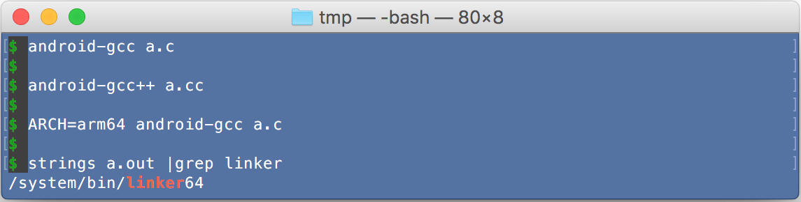
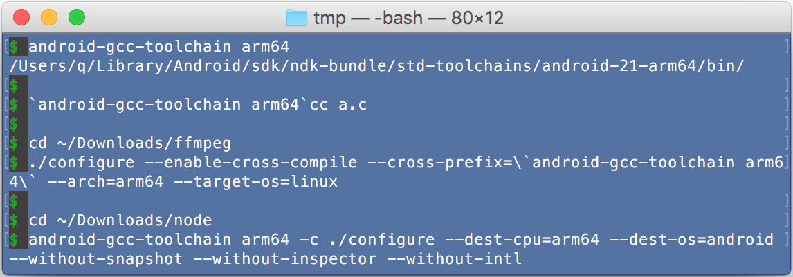
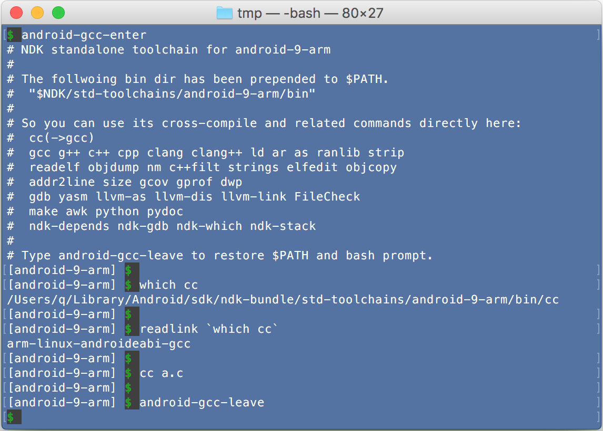

## android-gcc-toolchain
A single command to enter android cross compile environment without manually create NDK standalone toolchain. 

Tested on Mac OS X 10.11.5/10.11.6 EI Capitan, NDK 12.1.29.  
Should also works on Linux (not tested yet).

**As a sample, the last section show how to build NodeJS for Android arm64/arm perfectly**






###Features/Ideas

1. **Run android gcc related commands easily.**

    ```
    $ android-gcc  a.c
    $ android-gcc++  a.cc
    $ ARCH=arm64 android-gcc  a.c
    ```    
    Alternatively, you can use:
    ```
    $ `android-gcc-toolchain`gcc  a.c
    $ `android-gcc-toolchain arm64`gdb
    ```
    Obviously, options are same as original gcc,g++, yet with the ability to specify toolchain's arch, api level etc.
    
2. **Cross-compile gyp/autoconf project easily.**

    - **For autoconf build, e.g. ffmpeg.**
        
        Just embed `android-gcc-toolchain arm64` to cross-prefix.
        ```
        $ ./configure --enable-cross-compile --cross-prefix=`android-gcc-toolchain arm64` --target-os=linux --arch=arm64 ...
        $ make -j4
        ```

    - **For gyp build, e.g. NodeJS.**

        There are several cases.
        
        - Redirect all compiler related commands to the toolchain then build.

            ```
            $ android-gcc-enter arm64
            ...
            [android-21-arm64] $ ./configure --dest-cpu=arm64 --dest-os=android --without-snapshot --without-inspector --without-intl 
            [android-21-arm64] $ make -j4
            ```
            This is the most concrete way to build target(Android)-side only project.
            Any attempt to produce host-side output will cause error.
            
        - Enter a `$CC`... predefined environment to build.
        
            ```
            $ android-gcc-toolchain arm64 -c
            bash-3.2$ ./configure --dest-cpu=arm64 --dest-os=android --without-snapshot --without-inspector --without-intl 
            bash-3.2$ make -j4
            ```
            This is a graceful way to build target(Android)-side only project.
            Attempt to produce host-side output maybe OK, depends on build system.
            
        - Enter a `$CC_target`... predefined environment to build.
        
            ```
            $ android-gcc-toolchain arm64 -C      ###upper case -C
            bash-3.2$ ./configure --dest-cpu=arm64 --dest-os=android --without-snapshot --without-inspector --without-intl 
            bash-3.2$ make -j4
            ```
            This is the most graceful way to build a hybrid project(Both target and host side output).
            Target command honor the `$CC_target`..., host command honor its own (e.g. /usr/bin/cc, or $CC_host or $CC)
            
            The most complicated case is: some build system wrongly call host-side command for target build, 
            or attempt to link target related lib for host build.
            Please read the last section **"About hack mode"**.
        
        ....................................................................
            
        Wrap up: without interactively enter command in the new bash, you can wrap each command with this tool.
         
            $ android-gcc-toolchain arm64 -c ./configure ... 
            $ android-gcc-toolchain arm64 -c make ...
    
3. **Enter a dedicated environment where can run android gcc related commands directly.**

    - **`android-gcc-enter` to run cc c++ gdb readelf make python etc. without path.**

        ```
        $ android-gcc-enter arm64
        ...
        [android-21-arm64] $ which gcc
        /Users/q/Library/Android/sdk/ndk-bundle/std-toolchains/android-21-arm64/bin/gcc
        [android-21-arm64] $ gcc  a.c
        [android-21-arm64] $ android-gcc-leave
        $ 
        ```
        You can do safest cross-compile as shown in section 2, and even compile some non-cross-compilable project.

    - **`android-gcc-toolchain -c` to start a separate bash so can run `$CC` etc.**
    
        It just set `$CC`,$CXX,$LINK,$LD,... for the new bash instead of changing $PATH
        ```
        $ android-gcc-toolchain arm64 -c
        bash-3.2$ echo $CC
        /Users/q/Library/Android/sdk/ndk-bundle/std-toolchains/android-21-arm64/bin/gcc
        bash-3.2$ $CC  a.c
        bash-3.2$ exit
        ```
        You can do cross-compile as shown in section 2.

        Similarly, there are an upper case `-C` option provide `$CC_target`....
        ```
        $ android-gcc-toolchain arm64 -C
        bash-3.2$ echo $CC_target 
        /Users/q/Library/Android/sdk/ndk-bundle/std-toolchains/android-21-arm64/bin/gcc
        bash-3.2$ exit
        ```
        This is for some complicated build system which build both host and target output.
        Please read the last section **"About hack mode"**.

4. **Automatically create standalone toolchain the first time.**

    With same command-line options of 
    $NDK/build/tools/make_standalone_toolchain.py (except for --install-dir options of course).    

    ```
    $ android-gcc-toolchain --help
    ...
    $ android-gcc-enter --help
    Options: [[--arch] ARCH］[[--api] APIL] [[--stl] STL] [--force]
     --arch ARCH    Android architecture
       ARCH         {arm(default)|arm64|x86|x86_64|mips|mips64}
     --api APIL     Android API Level
       APIL         {min(default)|max|an integer}
     --stl STL      C++ STL to use
       STL          {gnustl(default)|libc++|stlport}
     --force        delete existing toolchain dir then create
     ...
    ```
    Option keyword itself(`--arch`,`--api`,`--stl`) can be omitted. Order does not care.
    
    The `android-gcc` and `android-gcc++` is controlled by `$ARCH`, `$APIL`, `$STL`, 
    the toolchain will also be created if not exists. 
    
5. **Automatically get minimum/maximum `Android API level` from NDK.**

    ```
    $ android-gcc-toolchain --api max
    $ android-gcc-toolchain 23
    $ android-gcc-enter arm64 23
    ```
    By default, get minimum API level from NDK for specified arch.

6. **(TODO) Miscellaneous**
    - (TODO): Create a docker container for this tool. 
    - (TODO): Use symbol/hard link to speed up creation of toolchain and save disk space. 
    - (TODO): Auto detect NDK, auto download NDK optionally. 
    - (TODO): Support brew install. 

###Prerequisite

- Install Android NDK (from Android SDK Manager or directly download it) and set NDK env to the dir.

    ```
    export NDK=__the_top_dir_of_installed_NDK__
    ```

###Install

Almost nothing more than `git clone` this project to somewhere e.g. `~/Downloads/android-gcc-toolchain`.
Then all commands except `android-gcc-enter` are just there for you.
The `android-gcc-enter` is a shell function come from this project 
which need you load my `bashrc` first, to use it, you need use `source` command to load it first.
(once you load it, all commands are cached as shell functions.)

- So the simplest way is:

    ```
    cd ~/Downloads && git clone https://github.com/sjitech/android-gcc-toolchain && \
    source ./android-gcc-toolchain/bashrc --save
    ```
    Tip: you can specify other bash profile such as ~/.profile as last argument.

###Uninstall

Manually remove script with mark "ANDROID_GCC_BASHRC" from your .bash_profile or use following command to remove it.
```
source ~/Downloads/android-gcc-toolchain/bashrc --restore
```
    
###Caveats
- This tool create files in your NDK dir, named `std-toolchains`.

    `$NDK/std-toolchains/android-APIL-ARCH`

    This is not only for easy management, but also for some commands e.g. 
    `ndk-gdb`,`ndk-which`... call neighbour files from this dir level.
    This is only necessary for `android-gcc-enter`'s dedicated environment
    where `ndk-*` be redirected so need keep it works as normal.

- If you upgrade your NDK, you need specify `--force` option to 
`android-gcc-toolchain` or `android-gcc-enter` to recreate toolchains. 

----

### About hack mode: `android-gcc-toolchain --hack -C`

Currently `--hack` solves following problems for Mac OS X:

1. **ar**: Some projects does not honor `$AR_target` when make Android-side static
 lib(*.a). Instead, they call Mac-side ar command, so cause wrong result.
 
    `--hack` detect input *.o file format, Mac or Android, then call correct one.
    This is done by hook `ar` command via \$PATH. (prepend hack/...bin to \$PATH 
    so ...bin/ar will be called instead.)
 
2. **librt**: Some projects use link option `-lrt` (librt) comes from linux, but
 Mac have no librt, so cause "library not found for -lrt".
 
    `--hack` append hack/...lib to `$LIBRARY_PATH`, so the fake librt can be linked.
    The fake librt does not export any symbol, it is just a reference to the most
    commonly linked lib: /usr/lib/libSystem.B.dylib
 
3. **`host_os`**: Some wrong gyp treat `host_os` as `android` so compile wrong files."

    `--hack` will set env `GYP_DEFINES=\"host_os=mac\"` for gyp."

4. (Optional) **m32**: On 64bit OS, some projects added `-m32` option to gcc/g++ to produce
 32bit codes, but some not added, cause link error of mixing 64 and 32bit codes.
 
    `--hack m32` forcibly add `-m32` option(cause 32bit codes) by hook gcc/g++ via \$PATH.
 
5. (Optional) **no-m32**: Same problem as 4.
 
    `--hack no-m32` forcibly remove `-m32` option(cause 64bit codes).

For example, 

###Build NodeJS for Android arm64 perfectly on Mac OS X.

**`perfectly` means do not add any `--without-...` option.**

NodeJS is the latest master version, at least 6.3.1
(HEAD is https://github.com/nodejs/node/commit/b9487449e151b02ff8cb1f3b4a0311e9eb0878e2)

```
$ android-gcc-toolchain arm64 --hack -C
bash-3.2$ ./configure --dest-cpu=arm64 --dest-os=android && make -j4
...
bash-3.2$ ls -lF
$ ll out/Release
total 136904
drwxr-xr-x   4 q  staff       136  8 13 10:21 .deps/
-rwxr-xr-x   1 q  staff   7026496  8 13 10:39 cctest*
-rwxr-xr-x   1 q  staff   2564184  8 13 10:23 genccode*
-rwxr-xr-x   1 q  staff   2787332  8 13 10:23 genrb*
-rwxr-xr-x   1 q  staff   2228608  8 13 10:23 iculslocs*
-rwxr-xr-x   1 q  staff   2648664  8 13 10:23 icupkg*
-rwxr-xr-x   1 q  staff  15370648  8 13 10:29 mksnapshot*
-rwxr-xr-x   1 q  staff  34321312  8 13 10:39 node*
drwxr-xr-x   3 q  staff       102  8 13 10:19 obj/
drwxr-xr-x  16 q  staff       544  8 13 10:29 obj.host/
drwxr-xr-x  30 q  staff      1020  8 13 10:39 obj.target/
-rwxr-xr-x   1 q  staff   3126928  8 13 10:22 openssl-cli*
bash-3.2$
bash-3.2$ file out/Release/*
out/Release/cctest:      ELF 64-bit LSB shared object, version 1 (SYSV), dynamically linked (uses shared libs), not stripped
out/Release/genccode:    Mach-O 64-bit executable x86_64
out/Release/genrb:       Mach-O 64-bit executable x86_64
out/Release/iculslocs:   Mach-O 64-bit executable x86_64
out/Release/icupkg:      Mach-O 64-bit executable x86_64
out/Release/mksnapshot:  Mach-O 64-bit executable x86_64
out/Release/node:        ELF 64-bit LSB shared object, version 1 (SYSV), dynamically linked (uses shared libs), not stripped
out/Release/obj:         directory
out/Release/obj.host:    directory
out/Release/obj.target:  directory
out/Release/openssl-cli: ELF 64-bit LSB shared object, version 1 (SYSV), dynamically linked (uses shared libs), not stripped
```
You can see the most annoying mksnapshot, genccode ... have been produced successfully.

You can confirm the environment.
```
bash-3.2$ which ar
/Users/q/Downloads/android-gcc-toolchain/hack/Darwin/bin/ar
bash-3.2$ env |grep -E 'AR_|LIBRARY_PATH'
LIBRARY_PATH=/Users/q/Downloads/android-gcc-toolchain/hack/Darwin/lib
_AR_host=/usr/bin/ar
AR_target=/Users/q/Library/Android/sdk/ndk-bundle/std-toolchains/android-21-arm64/bin/ar
```

###Build NodeJS for Android arm perfectly on Mac OS X.
```
$ android-gcc-toolchain arm --hack m32 -C
bash-3.2$ ./configure --dest-cpu=arm --dest-os=android && make -j4
...
```

Good luck.