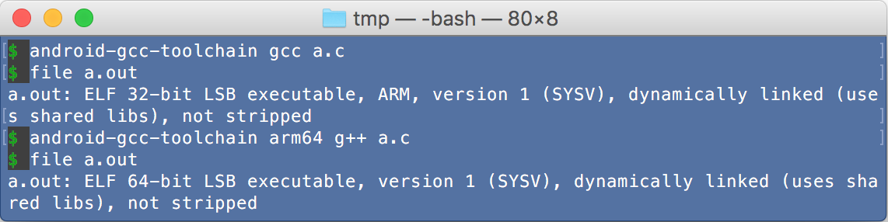
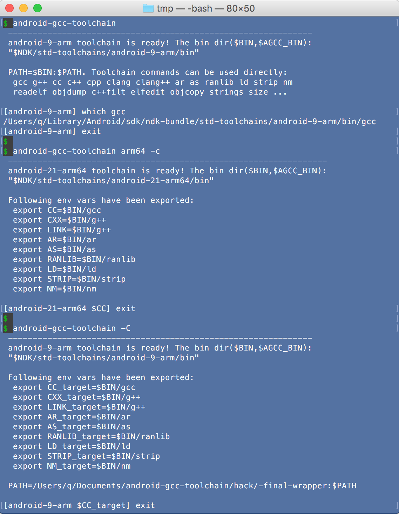

# android-gcc-toolchain
Enable you to use NDK's standalone toolchain easily, quickly and magically for cross-compile.

As an example, see [Build NodeJS for Android perfectly](https://github.com/sjitech/build-nodejs-for-android-perfectly).

Tested OS:
- **Mac**: OS X 10.11.5/10.11.6 EI Capitan (64bit)
- **Linux**: Ubuntu 16.04 (64bit)
- **Windows**: Windows Pro 7 (64bit). With [GIT Bash for Windows](https://git-for-windows.github.io/) installed.

Also tested in Docker (Docker image id: `osexp2000/android-gcc-toolchain`)
    via [Docker-Toolbox](https://www.docker.com/products/docker-toolbox).
    See [Features-9: Use this tool in Docker](#docker).

## Prerequisite

NDK: tested on
 - NDK 12.1.29 ([For Mac 64bit](https://dl.google.com/android/repository/android-ndk-r12b-darwin-x86_64.zip),
    [For Linux 64bit](https://dl.google.com/android/repository/android-ndk-r12b-linux-x86_64.zip))

Install Android NDK and set env var `NDK` to the dir: `export NDK=__the_top_dir_of_installed_NDK__`.

Otherwise, it will guess NDK dir from env vars: ANDROID_NDK_ROOT ANDROID_NDK_HOME NDK_ROOT NDKROOT ANDROID_NDK ANDROID_SDK_HOME
 ANDROID_SDK_ROOT ANDROID_SDK ANDROID_HOME ANDROID_ROOT.

## Install

Nothing. Just use the `android-gcc-toolchain` with full path, 
otherwise link it to /usr/local/bin/ or add the path to the $PATH. 

<a name=ccache></a>
If you clean & compile repeatedly, **you'd better setup [CCACHE](https://ccache.samba.org/) to speed up repeating compilation**.
- Run `brew install ccache` on Mac or `sudo apt-get install ccache` on Linux
- `export USE_CCACHE=1` to tell android-gcc-toolchain to use CCACHE(otherwise specify --ccache every time).
- `export CCACHE_DIR=some_dir`(default is ~/.ccache).
- run `ccache -M 50G` once to set max cache size(default is 5G).

## Screenshot

- Run android gcc related commands easily



- Enter a dedicated shell where can run android gcc related commands easily:



## Usage

Enable you to enter an android-oriented cross-compile environment easily.

*Note: words in `[  ]` means may be omitted. "|" means "or". {...} means selection. (default) means can be omitted*
<a name="options"></a>
```
Usage: android-gcc-toolchain [OPTIONS] [CMD [ARGS...]]
--------------------------------------------------------------------------------
OPTIONS: for toolchain, env mode, CCACHE, host compiler,...

Toolchain options: specify which toolchain to use or create
 [--arch] ARCH  Android architecture:
                {arm(default)|arm64|x86|x86_64|mips|mips64} or aliases:
                i386,ia32(=x86), x64(=x86_64), mipsel, mipsel64
 [--api]  APIL  Android API level:
                {min(default)|max|an integer}
 [--stl]  STL   C++ STL to use:
                {gnustl(default)|libc++|stlport}
 --force        Delete existing toolchain dir then create
 --copy         Force copy files instead of create hard link of files when
                create toolchain first time

Env mode options: Specify whether set $PATH or $CC... or $CC_target...
 omitted        This is the Redirect mode.
                Set $PATH to redirect gcc... to the toolchain's gcc...
                e.g. export PATH=".../std-toolchains/.../bin:$PATH"
 -c             Set $CC,$CXX,$LINK,$AR,$AS,$RANLIB,$LD,$STRIP,$NM
                e.g. export CC=".../std-toolchains/.../bin/gcc"
 -C             Set $CC_target,$CXX_target,$LINK_target,...,$NM_target
                e.g. export CC_target=".../std-toolchains/.../bin/gcc"

CCACHE option: Speed up repeating compilation
 --ccache       Means compilers(gcc/g++/cc/c++) will run via ccache command.
                Redirect mode: android compilers use ccache.
                $CC mode(-c): android compilers use ccache.
                $CC_target mode(-C): android and host compilers use ccache.
                Note: If $USE_CCACHE is 1 then this option is implied.

Host compiler option: Add/remove options to host compiler forcibly
 --host  RULES  Mandatory host compiler rules. Must be a comma joined 
                combination of available rules(Use --help-host to show).
                Only works for $CC_target mode(-C).
                This is done by supersede host compiler in $PATH by some
                wrapper scripts to add/remove option then transfer to original.

Other options:
 -v, --verbose  Show verbose information
 --version      Show version of this tool
 -, --          Means the end of options and next arg is CMD. But if nothing 
                followed, then just print output the bin dir(slash ended).
--------------------------------------------------------------------------------
CMD and ARGS: The external command to be run

 CMD            Any command. Default is /bin/bash.
                The first non-option arg will be treated as CMD.
                To avoid ambiguous with other option, place - or -- before CMD
 ARGS...        The arguments for the CMD
```

The syntax is very natural, option keyword itself(`--arch` etc.) can be omitted, order does not care. e.g.

The following commands are same:
```
android-gcc-toolchain --arch arm64 --api 24
android-gcc-toolchain arm64 24
```

When want run commands(such as gcc), just prepend above command to your command. e.g. 
`CMD ARGS...` -> `android-gcc-toolchain arm64` `CMD ARGS...`, it works as it implies.

----

## Features

### 1. Run android gcc related commands easily.

- Just prepend `android-gcc-toolchain` to your gcc related command.

    ```
    android-gcc-toolchain gcc a.c
    android-gcc-toolchain arm64 gcc a.c
    ```
    
<a name="dedicated-shell"></a>    
### 2. Start a dedicated shell where can run android gcc related commands easily.

- start an interactive shell with gcc... ready

    ```
    android-gcc-toolchain arm64                               #bash
    android-gcc-toolchain arm64 zsh                           #zsh
    ```

- start an interactive bash with $CC... predefined

    ```
    android-gcc-toolchain arm64 -c
    ```

    See also: [About env vars passed to CMD](#about-env-vars-passed-to-cmd) 

- start an interactive bash with $CC_target... predefined
    
    ```
    android-gcc-toolchain arm64 -C
    ```

    See also: [About env vars passed to CMD](#about-env-vars-passed-to-cmd).


- *Notes*

    To feed multiple commands to the shell non-interactively,
    you can use `<<EOF`[Here Document](http://tldp.org/LDP/abs/html/here-docs.html) or 
    `<<<"..."`[Here String(bash only)](http://tldp.org/LDP/abs/html/x17837.html)
    or `bash -c` to feed commands to the shell, or you call this tool multiple times.
    With options `arm64`,`-C` as example:
    
    ```
    $ android-gcc-toolchain arm64 -C <<EOF
    CMD1 ARGS... && CMD2 ARGS...
    EOF
    $ android-gcc-toolchain arm64 -C <<< "CMD1 ARGS... && CMD2 ARGS..." 
    $ android-gcc-toolchain arm64 -C sh -c "CMD1 ARGS... && CMD2 ARGS..." 
    $ android-gcc-toolchain arm64 -C CMD1 ARGS && android-gcc-toolchain arm64 -c CMD2 ARGS..." 
    ```

    *bash-only: you can use \EOF to disable pathname and var expansion*

### 3. Cross-compile an AUTOCONF project(e.g. ffmpeg) easily.

- Just use `android-gcc-toolchain arm64 -` as prefix of gcc....

    You can treat `-` as a special command which just print toolchain bin dir(slash ended). e.g.
    the result is `/Users/q/Library/Android/sdk/ndk-bundle/std-toolchains/android-21-arm64/bin/`
    
    ```
    ./configure --enable-cross-compile --cross-prefix=`android-gcc-toolchain arm64 -` --target-os=linux --arch=arm64 && make
    ```

### 4. Cross-compile an GYP project(e.g. NodeJS) easily.

- Redirect all compiler related commands to the toolchain's one.

    ```
    android-gcc-toolchain arm64 <<< "./configure --dest-cpu=arm64 --dest-os=android --without-snapshot --without-inspector --without-intl && make"
    ```
    
    This is the most concrete way to do target-only cross-compile.
    Attempt to call gcc related commands without explicit path will fall into the toolchain's one.
    
- Enter a `$CC`... predefined environment to build.

    ```
    android-gcc-toolchain arm64 -c <<< "./configure --dest-cpu=arm64 --dest-os=android --without-snapshot --without-inspector --without-intl && make"
    ```
    
    *The first `-c` is for `android-gcc-toolchain`, not for bash.*   
    This is a graceful way to do target-only cross-compile.
    
- Enter a `$CC_target`... predefined environment to build.

    ```
    android-gcc-toolchain arm64 -C <<< "./configure --dest-cpu=arm64 --dest-os=android && make"
    ```
    
    *The `-C` is UPPER CASE.*  
    This is the most graceful way to do a hybrid cross-compile, it assumes:
    - Compiler commands for target(Android) honor the `$CC_target`...,
    - Compiler commands for host(Mac) honor the `$CC_host`... or `$CC`... or pick from `$PATH`.
    
    **But above command will run into error, just because several wrong project settings.**  
    You can use [Mandatory host compiler rules](#host-compiler-rules) to overcome them easily, 
    otherwise you have to find and modify the wrong settings each time.

### 5. Automatically get minimum/maximum `Android API level` from NDK.

- Specify `max`, `min`, or an valid Android API level to the tool.

    By default, get minimum API level from NDK for specified arch smartly, 
    from actual folder names `$NDK/platforms/android-*/arch-$ARCH`, instead of a fixed 21.

    ```
    $ android-gcc-toolchain arm64 max
      ...
      android-24-arm64 toolchain is ready! ...
    ```

### 6. Automatically create standalone toolchain at first time.

- As described in [options](#options), options are compatible with $NDK/build/tools/make_standalone_toolchain.py:
`--arch`,`--api`, `--stl`,`--force`,`--verbose`.

### 7. Use hard links to speed up creation of toolchain and save disk space.

- By default, use hard links. The creation became very fast.
- This is done by run a modified py file on-the-fly instead of original $NDK/build/tools/make_standalone_toolchain.py. 
- The modified py file replace shutil.copy2 and shutil.copytree with customized copy2 and copytree which use hard link.
- You can specify `--copy` to force use traditional copy mode. 

### 8. Support CCACHE to speed up repeating compilation.

- When you clean & compile repeatedly, you'd better use CCACHE.
- Need install CCACHE first and config it as described in [Install-CCACHE](#ccache).
- See [About how CCACHE are used](#about-how-ccache-are-used)

<a name=docker></a>
### 9. Use this tool in Docker (Docker image id: `osexp2000/android-gcc-toolchain`)

- You can run docker with docker to enter a [dedicated shell](#dedicated-shell). e.g.
 
    ```
    $ docker run -it osexp2000/android-gcc-toolchain arm64
    ... ...
    [android-21-arm64] YOUR_COMMAND_HERE 
    ```
    
    *(do not enter the `$` or `[...]` which are just a prompt for illustrate).*

- Quick start of docker:
    - The docker run `-it` means `--interactive --tty`.
    - Use volume mapping `-v HOST_DIR_OR_FILE:CONTAINER_DIR_OR_FILE` to map dir/files to container. 
      Note: **Docker-Toolbox on Windows need host dir or files is under `C:\Users\...`(e.g. C:\Users\q\Downloads),
      and the `HOST_DIR_OR_FILE` must be converted to `/c/Users/...` style.**
    - Use `docker cp` to copy files in/out when forgot to use volume mapping.
    - Do not specify `-t`(`--tty`) if to feed commands to docker via <<<"Here String" or <<EOF Here Document.

### 10. (TODO) Support brew install, bash_autocomplete 

----

## About where the toolchain created and what's in it

- This tool create dir in your NDK dir, in following format:   
 `$NDK/std-toolchains/android-APIL-ARCH[STL_TAG]`

- If NDK is upgraded, please specify `--force` to recreate toolchains 

- Basically, the toolchain is created by modified version of `$NDK/build/tools/make_standalone_toolchain.py`, 
    Use hard link by default instead of copy

- Some extra works:
    - For default gnustl C++ STL only: enable use of `std::snprintf` 
        by `#inlcude <cstdio>` or `#include <string>` like libc++
        - Insert definition of `std::snprintf` to "$BIN"/../include/c++/?.?.?/cstdio
        - Append `#include <cstdio>` to "$BIN"/../include/c++/?.?.?/string
    - For mipsel only: ln -f "$BIN"/../include/c++/?.?.?/*/bits/*.h "$BIN"/../include/c++/?.?.?/bits/ 
        to avoid error of `bits/c++config.h not found` when specified `-mips32r2` to gcc/g++.

*?.?.? means gcc version such as 4.9.x*

## About env vars passed to CMD

- `PATH`: will be changed under certain conditions:
    use [Redirect mode](#about-redirect-mode) 
    or use [Mandatory host compiler rules](#host-compiler-rules))
    or use CCACHE([About how CCACHE are used](#about-how-ccache-are-used)). 
    When called recursively, it will be restored first

- GYP_DEFINES: will be set to "host_os=<mac|linux>" to specify host_os for gyp.

- BIN AGCC_BIN AGCC_HACK_DIR: will be set for cleaner and as mnemonics.

- Following vars will be set for $CC mode(-c) or $CC_target mode(-C), otherwise cleared:
 - CC CXX LINK AR CC_target CXX_target LINK_target AR_target
 - AS RANLIB LD STRIP NM AS_target RANLIB_target LD_target STRIP_target NM_target

## About Redirect mode

In this mode(means without -c|-C), the following commands are redirected to the toolchain's one.

- cc(->gcc) gcc g++ c++ cpp clang clang++ ar ar as ranlib ld strip ...
- readelf objdump nm c++filt elfedit objcopy strings size ...
- addr2line gcov gprof gcore dwp ...
- llvm-as llvm-dis llvm-link FileCheck ...

### About NDK python,make,awk,yasm,gdb,ndk-depends... (prebuilt common utilities)

- The \$NDK/prebuilt/*/bin/ are always appended to \$PATH. so these utilities are
  always available, but not the first choice in \$PATH

## About how CCACHE is used

- Supersede android compilers
    - Redirect mode: register wrapper scripts via $PATH
    - $CC mode(`-c`): change $CC... to use ccache command
    - $CC_target mode(`-C`): change $CC_target... to use ccache command
- Supersede host compilers
    - $CC_target mode(`-C`): append an internal host compiler rule "--ccache" 
        which register wrapper scripts via $PATH
        *It's ensured that the these wrapper will be run last in the rule chain.*

<a name="host-option"></a>
<a name="host-compiler-rules"></a>
## About Mandatory host compiler rules (--host RULES): 

This tool provide wrapper scripts to supersede compiler commands(gcc|g++|cc|c++) via $PATH, optionally.
These wrapper scripts 
- smartly find original compiler command in $PATH behind itself, 
- add or remove options then transfer to original compiler command.
- can be chained. The first specified, the first run.
 
The mandatory host compiler rules solves some common cross-compile problems on Mac or Linux:

- [Mac] **ar**: Some projects does not honor `$AR_target` when make android static
 lib(*.a). Instead, they call Mac ar command, so cause link error.
 
    `--host ar-dual-os` detect input \*.o file format, Mac or android, then call correct one.
 
- [Mac] **-lrt**: Some projects use link option `-lrt` (librt) comes from linux, but
 Mac have no librt, so cause link error "library not found for -lrt".
 
    `--host gcc-no-lrt` remove -lrt option.
 
- [Mac/Linux] **-m32**: On 64bit OS, some projects added `-m32` option to gcc to produce
 32bit codes, but some forgot, cause link error of mixing 64 and 32bit codes.
 
    `--host gcc-m32` prepend -m32 option if not specified.

- [Linux] **-lpthread**: Some projects forgot to add this option so cause strange link error:
 `...libpthread.so.0: error adding symbols: DSO missing from command line`.

    `--host gcc-lpthread` append -lpthread option, only when found any other -l option.

----
Good luck.
