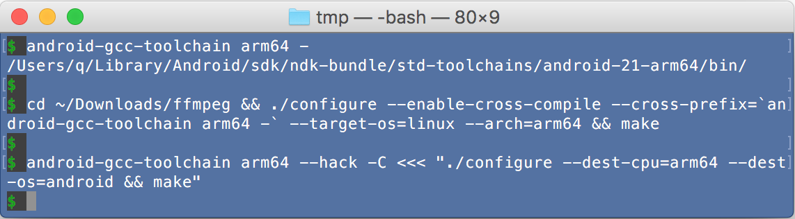

## android-gcc-toolchain
A single command to enter android cross compile environment without manually create NDK standalone toolchain and env vars. 

- Mac: OS X 10.11.5/10.11.6 EI Capitan (64bit)
    - [NDK 12.1.29](https://dl.google.com/android/repository/android-ndk-r12b-darwin-x86_64.zip)
- Linux: Ubuntu 16.04 (64bit)
    - [NDK 12.1.29](https://dl.google.com/android/repository/android-ndk-r12b-linux-x86_64.zip)

As an example, see

- [Build NodeJS for Android perfectly on Mac](#build-nodejs-for-android-perfectly-on-mac).
- [Build NodeJS for Android perfectly on Linux](#build-nodejs-for-android-perfectly-on-linux).


### Prerequisite

Install Android NDK and set env var `NDK` to the dir. `export NDK=__the_top_dir_of_installed_NDK__`

### Install

Nothing. Just use the `android-gcc-toolchain` with full path, 
otherwise link it to /usr/local/bin/ or add the path to the $PATH. 

### Screenshot

- Run android gcc related commands easily:<a name="screenshot-android-gcc"></a>


- Enter a dedicated shell where can run android gcc related commands easily:<a name="screenshot-dedicated-shell"></a>


- Cross-compile AUTOCONF and GYP project easily:<a name="screenshot-cross-compile-autoconf-and-gyp"></a>


### Usage

Use or create toolchain, set env and run command, or print "the bin dir/".

*Note: words in `[  ]` means may be omitted.*
<a name="options"></a>
```
android-gcc-toolchain [OPTIONS] [CMD [ARGS...]]
--------------------------------------------------------------------------------
OPTIONS: Toolchain options, Command Mode, Misc options

Toolchain options: specify which toolchain to use or create
 [--arch] ARCH  Android architecture:
                {arm(default)|arm64|x86|x86_64|mips|mips64} or aliases:
                i386,ia32(=x86), x64(=x86_64), mipsel, mipsel64
 [--api]  APIL  Android API level:
                {min(default)|max|an integer} or aliases:
                0(=min), 99(=max)
 [--stl]  STL   C++ STL to use:
                {gnustl(default)|libc++|stlport}
 --force        Delete existing toolchain dir then create

Command Mode: Specify whether set $PATH or $CC... or $CC_target...
 omitted        This is the redirect mode.
                Set $PATH to redirect gcc... to the toolchain's gcc...
                e.g. export PATH=".../std-toolchains/.../bin:$PATH"
 -c             Set $CC,$CXX,$LD,$AR,$AS,$RANLIB,$STRIP,$NM,$LINK
                e.g. export CC=".../std-toolchains/.../bin/gcc"
 -C             Set $CC_target,$CXX_target,$AR_target... ...$LINK_target
                e.g. export CC_target=".../std-toolchains/.../bin/gcc"

Hack options:
 --hack  HACK   To correctly handle ar, ld -lrt etc. Should be combination of
                ar-dual-os,fake-librt,gcc-m32,g++-m32,gcc-lpthread,g++-lpthread,
                joined by comma or space.
                Available options depends on what's inside hack-<OS> dir.

Special options:
 -              Means the end of options and next arg is CMD. But if nothing 
                followed, then just print output the bin dir(slash ended).
 --             Same as -
--------------------------------------------------------------------------------
CMD and ARGS: The external command to be run

 CMD            Any command. Default is /bin/bash.
                The first non-option arg will be treated as CMD.
                To avoid ambiguous with other option, place - or -- before CMD
 ARGS...        The arguments for the CMD
```

The syntax is very natural, option keyword itself(`--arch` etc.) can be omitted, order does not care. e.g.

The following commands are same:
```
android-gcc-toolchain --arch arm64 --api 24
android-gcc-toolchain arm64 24
```

When want run commands(such as gcc), just prepend above command to your command. e.g. 
`CMD ARGS...` -> `android-gcc-toolchain arm64` `CMD ARGS...`, it works as it implies.

### Features/Ideas

1. **Run android gcc related commands easily.**

    Just prepend `android-gcc-toolchain` to your gcc related command.
    
    ```
    android-gcc-toolchain gcc a.c
    android-gcc-toolchain arm64 gcc a.c
    ```
    
    See [screehshot](#screenshot-android-gcc)
    
2. **Start a dedicated shell where can run android gcc related commands easily.**<a name="dedicated-shell"></a>

    - start an interactive shell with gcc... ready
    
        ```
        android-gcc-toolchain arm64                               #bash
        android-gcc-toolchain arm64 zsh                           #zsh
        ```
        
        See also: [redirected commands list](#about-redirect-mode).
        
    - start an interactive bash with $CC... predefined
    
        ```
        android-gcc-toolchain arm64 -c
        ```

        See also: [env vars passed to CMD](#about-env-vars-passed-to-cmd) 
    
    - start an interactive bash with $CC_target... predefined
        
        ```
        android-gcc-toolchain arm64 -C
        ```

        See also: [env vars passed to CMD](#about-env-vars-passed-to-cmd).

    Screen shot are [here](#screenshot-dedicated-shell). 

    To feed multiple commands to the shell non-interactively, 
    you can use `<<EOF`[Here Document](http://tldp.org/LDP/abs/html/here-docs.html) or 
    `<<<"..."`[Here String(bash only)](http://tldp.org/LDP/abs/html/x17837.html)
    or `bash -c` to feed commands to the shell, or you call this tool multiple times.
    With options `arm64 -c` as example:
    
    ```
    $ android-gcc-toolchain arm64 -c <<EOF
    CMD1 ARGS... && CMD2 ARGS...
    EOF
    $ android-gcc-toolchain arm64 -c <<< "CMD1 ARGS... && CMD2 ARGS..." 
    $ android-gcc-toolchain arm64 -c bash -c <<< "CMD1 ARGS... && CMD2 ARGS..." 
    $ android-gcc-toolchain arm64 -c CMD1 ARGS && android-gcc-toolchain arm64 -c CMD2 ARGS..." 
    ```
    
    *bash-only: you can use \EOF to disable pathname and var expansion*

3. **Cross-compile an AUTOCONF project(e.g. ffmpeg) easily.**

    Just use `android-gcc-toolchain arm64 -` as prefix of gcc....
    You can treat `-` as a special command which just print toolchain bin dir(slash ended). e.g.
    the result is `/Users/q/Library/Android/sdk/ndk-bundle/std-toolchains/android-21-arm64/bin/`
    
    ```
    ./configure --enable-cross-compile --cross-prefix=`android-gcc-toolchain arm64 -` --target-os=linux --arch=arm64 && make
    ```

4. **Cross-compile an GYP project(e.g. NodeJS) easily.**

    **Target-only cross-compile**<a name="cross-compile-target-only"></a>
    
    - Redirect all compiler related commands to the toolchain's then build.

        ```
        android-gcc-toolchain arm64 <<< "./configure --dest-cpu=arm64 --dest-os=android --without-snapshot --without-inspector --without-intl && make"
        ```
        
        This is the most concrete way to do target-only cross-compile.
        Attempt to call gcc related commands without explicit path will fall into the toolchain's one.
        
    - Enter a `$CC`... predefined environment to build.
    
        ```
        android-gcc-toolchain arm64 -c <<< "./configure --dest-cpu=arm64 --dest-os=android --without-snapshot --without-inspector --without-intl && make"
        ```
        
        *The first `-c` option is for `android-gcc-toolchain`, not for bash.*   
        This is a graceful way to do target-only cross-compile.
        
    **Hybrid cross-compile(Both target and host side have output)**<a name="cross-compile-target-and-host"></a>
    
    - Enter a `$CC_target`... predefined environment to build.

        ```
        android-gcc-toolchain arm64 -C <<< "./configure --dest-cpu=arm64 --dest-os=android && make"
        ```
        
        *The `-C` option is UPPER CASE.*  
        This is the most graceful way to do a hybrid cross-compile, it assumes:
        - Compiler commands for target(Android) honor the `$CC_target`...,
        - Compiler commands for host(Mac) honor the `$CC_host`... or `$CC`... or pick from `$PATH`.
        
        **But above command will run into error, just because several wrong project settings.**  
        You can use [Hack Mode](#about-hack-mode) to overcome them easily, 
        otherwise you have to find and modify the wrong settings each time.

4. **Automatically get minimum/maximum `Android API level` from NDK.**

    By default, get minimum API level from NDK for specified arch smartly, 
    from actual folder names `$NDK/platforms/android-*/arch-$ARCH`, instead of a fixed 21.
    
    As described in [options](#options), you can pass `max`,`99` or verbose `--api max` to get maximum API level.
    
    ```
    $ android-gcc-toolchain arm64 max
      android-24-arm64 toolchain is ready! ...
    ```

5. **Automatically create standalone toolchain the first time.**

    As described in [options](#options), options are compatible with $NDK/build/tools/make_standalone_toolchain.py:
    `--arch`,`--api`, `--stl`,`--force`.
    
6. **(TODO) Miscellaneous**
    - (TODO): Create a docker container for this tool. 
    - (TODO): Use symbol/hard link to speed up creation of toolchain and save disk space. 
    - (TODO): Auto detect NDK, auto download NDK optionally. 
    - (TODO): Support brew install. 

### About where the toolchain created

This tool create dir in your NDK dir, in following format:   
 `$NDK/std-toolchains/android-APIL-ARCH[STL_TAG]`

This is not only for easy management, but also for keep some commands work. 
e.g. `ndk-gdb`, `ndk-which`... call neighbour files from `\$NDK/SOME_DIR` level.
When in redirect mode, such command is called into the toolchain's one.
To keep them works same as previous, i have to choose such a dir hierarchy.

After you upgrade your NDK, you need specify `--force` option to recreate toolchains. 

### About env vars passed to CMD

As described in [options](#options),
Following vars will be set for specified Command Mode, **otherwise cleared**.
- GYP_DEFINES CC CXX LD AR AS RANLIB STRIP NM LINK CC_target CXX_target LD_target AR_target AS_target RANLIB_target STRIP_target NM_target LINK_target

BIN AGCC_BIN AGCC_HACK_DIR will be set for cleaner and as mnemonics.

`PATH` and `LIBRARY_PATH` will be changed under certain conditions described above.

When called recursively, it will try to restore `PATH` `LIBRARY_PATH` first.

### About redirect mode

Without `-c` nor `-C` option, the specified command will run in a `redirect mode`.
In this mode, the following commands are redirected to the toolchain's one.
- cc(->gcc) gcc g++ c++ cpp clang clang++ ld ar as ranlib strip ...
- readelf objdump nm c++filt elfedit objcopy strings size ...
- gdb addr2line gcov gprof gcore dwp yasm ...
- llvm-as llvm-dis llvm-link FileCheck ...
- ndk-depends ndk-gdb ndk-which ndk-stack ...

And as a fallback, following commands (moved to ../tools) are also available
but not the first choice if there are already same commands in $PATH.
- make, python, awk...

###About Hack mode
 
It solves some common cross-compile problems on Mac:

- **ar**: Some projects does not honor `$AR_target` when make Android-side static
 lib(*.a). Instead, they call Mac-side ar command, so cause wrong result.
 
    `--hack ar-dual-os` prepend hack dir to `$PATH` so its ar will be called first.
    **It detect input \*.o file format, Mac or Android, then call correct one.**
 
- **librt**: Some projects use link option `-lrt` (librt) comes from linux, but
 Mac have no librt, so cause "library not found for -lrt".
 
    `--hack fake-librt` append hack dir to `$LIBRARY_PATH`, so **it can be linked.**
    The fake librt does not export any symbol, it is just a reference to the most
    commonly linked lib: `/usr/lib/libSystem.B.dylib`
 
- **m32**: On 64bit OS, some projects added `-m32` option to gcc to produce
 32bit codes, but some forgot, cause link error of mixing 64 and 32bit codes.
 
    `--hack gcc-m32` prepend hack dir to `$PATH` so its gcc will be called first.
    **It forcibly add -m32 option then call original gcc.**
    
    `--hack g++-m32` is similar to gcc-m32.

It solves some common cross-compile problems on Linux:

- **lpthread**: Some projects forgot to add this option so cause linker error:
 `...libpthread.so.0: error adding symbols: DSO missing from command line`.

    `--hack gcc-lpthread` prepend hack dir to `$PATH` so its gcc will be called first."
    **It forcibly add -lpthread option then call original gcc when found any -l
    option which means linking to some lib.**

    `--hack g++-lpthread` is similar to gcc-lpthread.

----

### Build NodeJS for Android perfectly 

**`perfectly` means do not add any `--without-...` option, nor modifying any source (include build settings)**

[NodeJS](https://github.com/nodejs/node): 6.3.1-6.5.0

It's easy to build NodeJS for Android if specify --without-snapshot --without-inspector --without-intl --openssl-no-asm.

```
android-gcc-toolchain ARCH <<< "./configure --dest-cpu=ARCH --dest-os=android --without-snapshot --without-inspector --without-intl --openssl-no-asm && make"
```

To perfectly build without losing any functionality, you can:

- on Mac<a name="build-nodejs-for-android-perfectly-on-mac"></a>

    - android-arm
    
        ```
        android-gcc-toolchain arm --hack ar-dual-os,fake-librt,gcc-m32,g++-m32 -C <<< "./configure --dest-cpu=arm --dest-os=android && make"
        ```
            
    - android-arm64
    
        ```
        android-gcc-toolchain arm64 --hack ar-dual-os,fake-librt -C <<< "./configure --dest-cpu=arm64 --dest-os=android && make"
        ```
    
    - android-x86
    
        ```
        android-gcc-toolchain x86 --hack ar-dual-os,fake-librt,gcc-m32,g++-m32 -C <<< "./configure --dest-cpu=x86 --dest-os=android && make"
        ```
            
    - android-x64
    
        ```
        sed -i.bak 's/cross_compiling = target_arch != host_arch/cross_compiling = True/' configure
        android-gcc-toolchain x64 --hack ar-dual-os,fake-librt -C <<< "./configure --dest-cpu=x64 --dest-os=android --openssl-no-asm && make"
        ```
        The first command is to modify a bug of `configure` script, it's unavoidable.
        The `--openssl-no-asm` is needed because openssl configure is not ready for android-x64. 

- on Linux<a name="build-nodejs-for-android-perfectly-on-linux"></a>

    - android-arm64
    
        ```
        android-gcc-toolchain arm64 --hack gcc-lpthread,g++-lpthread -C <<< "./configure --dest-cpu=arm64 --dest-os=android && make"
        ```
    
See also: [build-nodejs-for-android-perfectly](https://github.com/sjitech/build-nodejs-for-android-perfectly).

Good luck.
